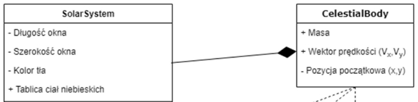
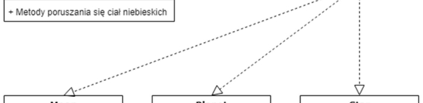
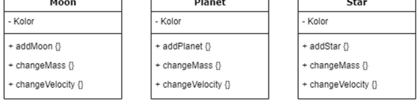
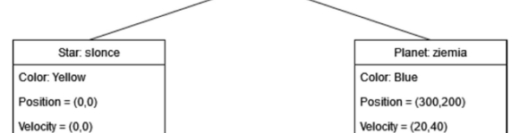
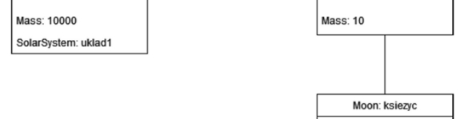
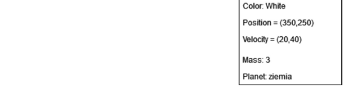

# Uklad planetarny

Projekt został wykonany w Pythonie. Obiekty układu poruszają się w dwóch wymiarach, co za tym idzie  posiadają swoje współrzędne (x, y). 

Wykorzystane klasy: 

Diagram obiektów: 

Interfejs graficzny został stworzony przez biblioteki graficzną Turtle oraz obliczeniową Math. Zdefiniowana została również rozdzielczość okna oraz kolor tła symulacji. 

Oddziaływania między nimi jest zbliżone do fizycznych oddziaływań grawitacyjnych działających na zasadzie prawa powszechnego ciążenia. 

Po wprowadzeniu danych wejściowych obliczona zostają interakcje między elementami układu, a następnie zostaje uruchomiony program. 
