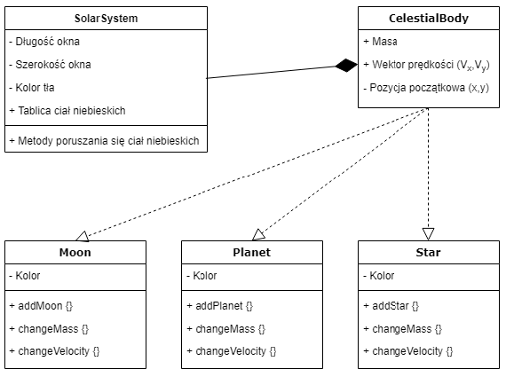
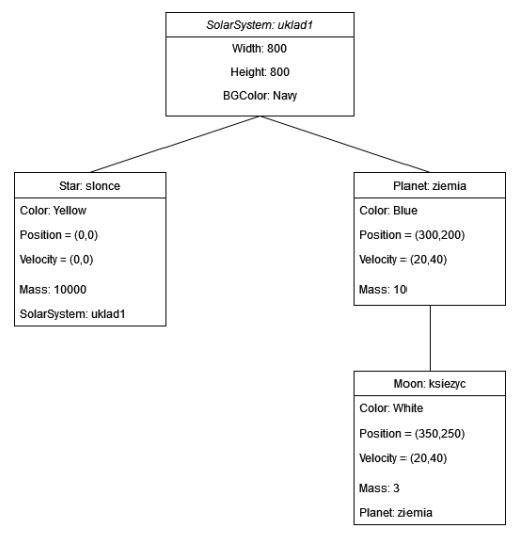
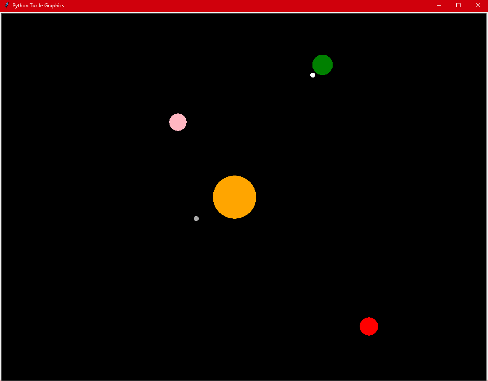
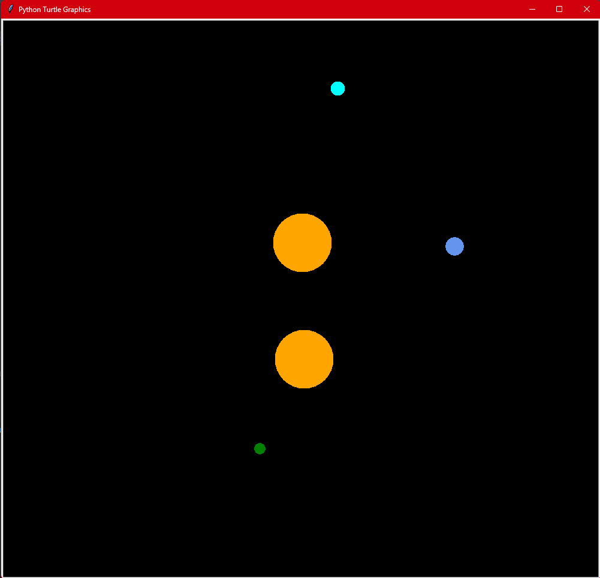

# SYMULACJA UKŁADU PLANETARNEGO

Projekt ma obrazować układ planetarny z gwiazdami. Pokazuje w jaki sposób działa prawo powszechnego ciążenia. Zawiera różne wariacje układów z różnymi ciałami niebieskimi z których użytkownik będzie mógł wybierać. Projekt wykonany został w Pythonie.

# Diagram klas

# Diagram obiektów

# Opis szczegółowy

Obiekty układu poruszają się w dwóch wymiarach, mając swoje współrzędne
(x,y).

Do zrobienia grafik zostały wykorzystane biblioteki: graficzna Turtle,
obliczeniowa Math. Funkcja sleep z biblioteki Time została użyta do
spowolnienia symulacji. Przez użytkownika zdefiniowana zostanie również
rozdzielczość okna oraz kolor tła.

Oddziaływania między obiektami są podobne do fizycznych oddziaływań
grawitacyjnych działających na zasadzie prawa powszechnego ciążenia.

Przy tworzeniu tego typu symulacji ważne jest aby odpowiednio ustawić
parametry ciał, aby zbyt odbiegające od rzeczywistości dane, nie wywołały
niepożądanych skutków (np. ciało “wylatuje” poza układ).

Słońca w rzeczywistości mają ogromne masy, na potrzeby naszej symulacji
użyliśmy skali logarytmicznej o podstawie 1.1, która z małych x zwraca
podobne liczby do x, a z wielkich liczb dużo mniejsze.

Funkcja kolizji jest stworzona na podstawie porównania odległości ciał i ich
rozmiarów. W momencie kontaktu dwóch ciał np. Planety i Słońca, Planeta
zostanie usunięta z symulacji.

Zaimplementowane zostało menu w którym użytkownik może skonfigurować
swoją symulację, zmienić masę, kolor, położenie i prędkość początkową ciała
niebieskiego.

Po wprowadzeniu danych obliczone zostaną interakcje między elementami
układu (przyspieszenie grawitacyjne, wykrywanie kolizji) i wyświetli się
program symulujący układ słoneczny.

# Zrzuty ekranu z symulacji

